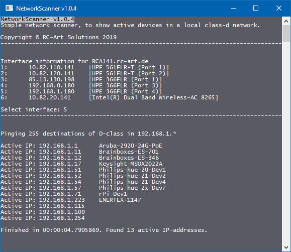

# NetworkScanner
Simple network scanner, to show active devices in a local class-d network.

## How to use

### Start the program
You can start the application ´NetworkScanner.exe´ directly without any args.

### Select interface
After start, you must select the interface which you want to use.

## Screenshoot

## Credits

* **Elias Ruemmler** - *Initial work* - [rmmlr](https://github.com/rmmlr)

Under [Contributors](https://github.com/rmmlr/HueHook/contributors) you can see more project supporter.

## License

This project (NetworkScanner) is licensed under  [MIT License](http://www.opensource.org/licenses/mit-license.php "Read more about the MIT license form").  
Refer to [LICENSE](https://github.com/rmmlr/NetworkScanner/blob/master/LICENSE.txt) for more information.

