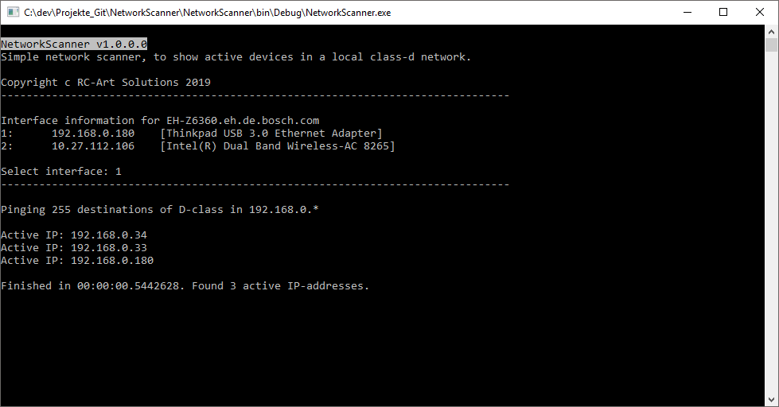

# Verwendung

## Starten
Anwendung (NetworkScanner.exe) kann direkt gestartet werden. Es handelt sich um ein Windows-Konsolen-Programm.

## Adapter wählen
Nach Programmstart listet das Programm alle aktiven Netzwerkadapter mit der zugehörigen lokalen IP auf.

Es muss die lokale Adresse des Netzwerkes angegeben werden, für welches der Scan durchgeführt werden soll. Auswahl erfolgt durch eingabe der angeziegten Nummern (1, 2...).

# Screenshoot
